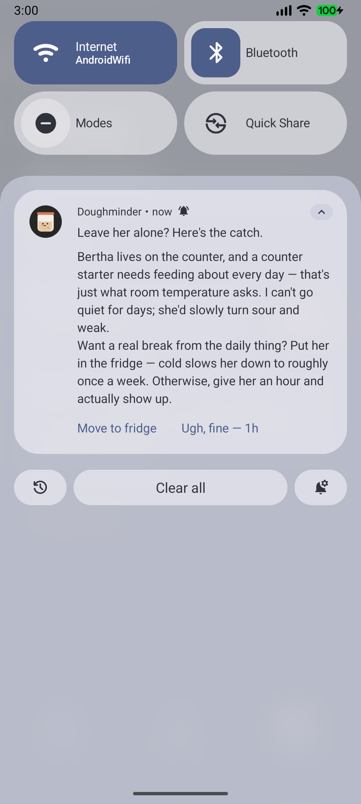

# Doughminder 🍞

An Android app that reminds you to feed your sourdough starter — and argues with you when you don't.

## Your starters

Add multiple starters, each with a name, pronouns (she/he/they), a flour color, and its own daily reminder time (default 8:00 AM). Each jar has a face whose mood tracks hunger: happy when fed, worried after a day, angry after two.

<p align="center"></p>

## Adopting a starter

<p align="center"></p>

## The daily nag — and the negotiation

At feeding time a notification asks *"Time to feed Bertha"* with three reply buttons right on it:

- **Yes, I fed her** → marks fed, resets the clock: *"Good. She forgives you. See you tomorrow, same time."*
- **Later** → she asks **"When?"** (1h / 3h / 6h), then **haggles you shorter** — "Six hours? Be honest with yourself. Bertha's fine for six hours; the problem is you won't remember at hour six. Three?" — before settling on whatever you pick and scheduling the re-nag. Each round escalates and stitches in real sourdough facts (hooch, acetone, pH vs. gluten) and guilt.
- **Leave me alone** → for a **counter** starter this is *refused*, because a room-temperature starter needs feeding about daily and can't be muted for days. It offers the honest fix — **Move to fridge** (drops her to ~weekly) — or a grudging 1h. Only **fridge/freezer** starters can actually be left until their next real feeding.

The copy is calibrated to the real timescale: a few hours late is *fine*, the danger is you forgetting; she only turns sour and weak after **days** overdue.

<p align="center">  </p>

## Recipes

Recipes with per-step timers that fire notifications when it's time for the next move. Add recipes in `app/src/main/java/com/edt/doughminder/data/Recipes.kt` (same `Recipe`/`RecipeStep` shape) and they appear automatically.

<p align="center"></p>

## Settings

Default reminder time for new starters, the "Argue back" toggle, the snooze length, and a test nag button.

<p align="center"></p>

## Architecture notes

- Kotlin + Jetpack Compose (Material 3), warm dark theme (ink `#262624`, cream text, coral `#D97757`, serif display type). No backend — everything is on-device.
- `data/Sass.kt` is the argument engine: pre-written escalation chains with `{name}`/`{she}`/`{her}` pronoun templating, isolated behind small functions (`morningTitle`, `laterReply(depth)`, …) so a lightweight on-device LLM could replace the line-picking later without touching the notification plumbing.
- Reminders use `AlarmManager` (exact when permitted, inexact fallback), re-armed on boot, app update, and app start. Starters and settings persist as JSON in DataStore.

## Build & install

```bash
./gradlew assembleDebug        # JDK path comes from gradle.properties
adb install app/build/outputs/apk/debug/app-debug.apk
```

Or open the folder in Android Studio and hit Run.

Requires a `local.properties` with your SDK path (Android Studio creates it automatically):

```properties
sdk.dir=/Users/you/Library/Android/sdk
```

On first launch, allow notifications. For minute-exact reminders on Android 14+, grant "Alarms & reminders" in system settings — the app falls back to approximately-on-time otherwise.
